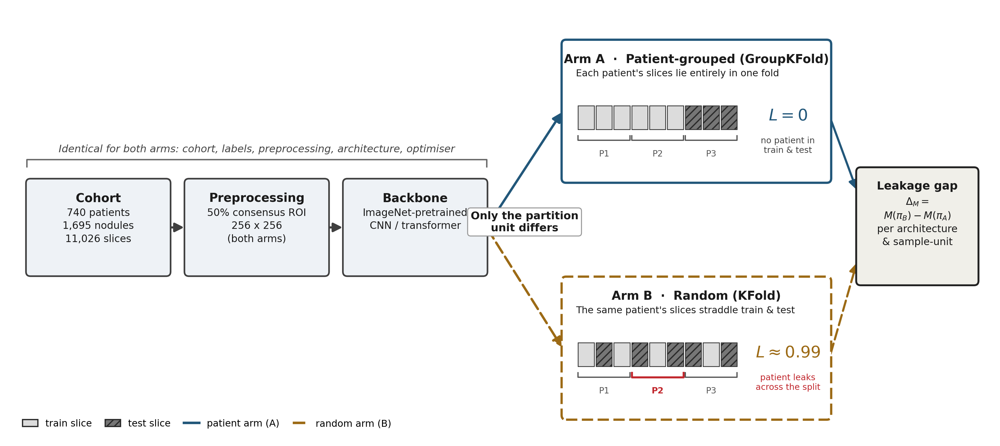

# Data-partition leakage in pulmonary nodule classification

Code, cross-validation partition indices and retained per-sample predictions for a controlled
experiment on **LIDC-IDRI**: how much does the *unit* at which data are partitioned inflate reported
performance, and **which** route produces the inflation?

Deep-learning studies on this benchmark routinely report accuracies above 95% and AUCs above 0.99.
Many partition below the patient, so observations from one patient appear in both training and test
folds. Rather than compare against heterogeneous published numbers, this study **tests the question
by design**: one cohort, identical labels, preprocessing, architecture and training, varying only the
partition unit.

> Manuscript under resubmission to *IEEE Access* (Access-2026-27906). Citation details will be added
> on acceptance; `CITATION.cff` carries the current metadata.

## The design

Three arms differing **only** in how folds are formed, over 3 repeats × 5 folds = 15 matched folds:

| arm | grouping | within-nodule route | patient route | measured L(patient) |
|---|---|---|---|---|
| **A** `patient` | by patient | off | off | 0.000 |
| **B** `random` | none | **on** | **on** | 0.995 |
| **C** `nodule` | by nodule | off | **on** | 0.690 |

A and B alone establish *that* the partition unit matters but cannot say *which* route does it — a
random split opens both at once. Arm C closes the within-nodule route while leaving the patient route
active **at full sample density**, which separates them.



Every number in that figure is read from the released artifacts when it is drawn, and exported
alongside it as `schematic_values.csv`; the render fails rather than fall back to a literal.

## What was found

**Partitioning below the nodule inflates reported performance, and the inflation is not where the
literature assumes.** At the pre-registered primary (slice) level, random partitioning raised AUC by
**+0.064** for DenseNet-121 (95% CI +0.031 to +0.097) and **+0.082** for EfficientNet-B0
(+0.056 to +0.108) — positive in **15 of 15** matched folds for both, and unchanged when the two arms
are re-scored on identical test rows. Calibration degrades in parallel (log-loss +0.176 and +0.315).

The three-arm decomposition localises it. Under the assumption that the two routes do not interact,
**no contribution from the patient route was detected** in either architecture (the interval permits
up to +0.046 AUC), while **within-nodule slice redundancy accounts for 92–98%** of the gap in
log-loss and Brier. The null is measured at full sample density — 12.4 training slices per patient —
in a cohort that does contain a patient signature to find (4 manufacturers, 18 reconstruction
kernels, 11 slice thicknesses), so it is not a null produced by starving the model of data.

The honest operating points are AUC 0.915 and 0.909, not the 95–99% the benchmark is usually
reported at. The practical consequence is a narrower and firmer recommendation than the usual advice:
**no study should partition below the nodule**, every study should state its partition unit, and
every study should release executable partition indices so the choice can be audited rather than
trusted.

## Requirements

```
conda env create -f environment.yml    # or: pip install -r requirements.txt
conda activate nodules
```
Python 3.10, PyTorch 2.3.1+cu121. Trained on a single 8 GB GPU (RTX 4060 Ti) using mixed precision
and gradient accumulation. See `docs/SPEC.md` for the methodology contract.

## Data

LIDC-IDRI is obtained from TCIA — it is **not** redistributed here. See `data/README.md` for the
download and for the `pylidc.conf` pointing at the DICOM root. Preprocessing produces ~8 GB of
arrays and model weights ~6 GB; neither is committed, both are regenerable from the committed code
and indices.

## Reproducing the paper

Every number in the manuscript is regenerated from committed artifacts **without a GPU**. Retraining
is only needed to reproduce the artifacts themselves.

```
# --- analysis only, from what is already committed (minutes, no GPU) -----------------
python scripts/verify_grid_consistency.py                        # gate: is the grid one experiment?
python scripts/audit_controls.py    --reps 0,1,2                 # headline gap + matched-rows control
python scripts/decompose_routes.py  --reps 0,1,2                 # the three-arm route decomposition
python -m src.evaluate --sample-unit slice --reps 0,1,2 --arms patient,random,nodule
python scripts/check_artifact_freshness.py                       # gate: is any table older than its runs?
python -m src.figures --reps 0,1,2 --sample-units slice,nodule   # curves + confusion matrices

# --- full rebuild, from raw DICOM (days, GPU) ----------------------------------------
python scripts/verify_download.py                                # data completeness
python -m src.metadata                                           # cohort tables
python -m src.preprocess                                         # ROI extraction -> .npy
python -m src.splits --arm patient --repeats 3 --folds 5         # and --arm random / --arm nodule
powershell -File scripts/run_grid.ps1 -Phase grid -Reps "0,1,2" -Arms "patient,random,nodule" -SampleUnits "slice,nodule"
```

`run_grid.ps1` is resumable and idempotent: it skips runs whose artifacts are already **content-valid**
(weights load, probabilities finite and length-matched to the test split), never by mere file
existence.

### Which script produces which result

| Manuscript item | Produced by | Reads |
|---|---|---|
| Table 1 — cohort and acquisition | `outputs/metadata/acquisition_params.csv` | DICOM headers |
| Table 2 — leakage gap, both levels | `scripts/audit_controls.py` | `outputs/probs/` |
| Table 3 — three-arm route decomposition | `scripts/decompose_routes.py` | `outputs/probs/` |
| Fig. 1 — design schematic | `paper/2_resubmission/figures/schematic.py` | `outputs/splits/`, `outputs/metadata/` |
| Fig. 2 — confusion matrices, both architectures | `src/figures.py` | `outputs/probs/` |
| Fig. 3 — learning curves, both architectures | `src/figures.py` | `outputs/history/` |
| Per-model tables, McNemar | `src/evaluate.py` | `outputs/probs/` |
| Stratification / ICC analysis | `scripts/project_stratification.py`, `scripts/project_balancer.py` | `outputs/probs/`, metadata |
| Consistency gate | `scripts/verify_grid_consistency.py` | `outputs/history/` |

## What is committed, and why

Partition indices, per-sample predictions and per-run training histories are **in the repository**
(~11 MB), not only the aggregated numbers:

- `outputs/splits/` — the partitions themselves. See `outputs/splits/README.md` for the naming,
  the grouping unit of each arm, and the measured leakage rates. This is what lets a reviewer check
  the partitioning claim without running anything.
- `outputs/probs/` — `y_true` and `y_prob` for every run, so **every reported metric can be
  recomputed without retraining**, on a laptop.
- `outputs/history/` — per-epoch train/val trajectory plus the configuration hash for each run.

This exceeds usual practice for a paper repository, and it is deliberate: for a study *about*
evaluation protocol, the per-sample outputs are the evidence, not a by-product.

**Excluded:** raw and preprocessed imaging (~8 GB) and model weights (~6 GB), both regenerable.

## Integrity machinery

The pipeline refuses to produce a result it cannot stand behind. Gates **block**, they do not warn:

- **Config–code contract** — every key in `config.yaml` must be read by code or explicitly declared
  inert, so the manuscript cannot describe behaviour the code does not implement.
- **Coverage** — training aborts unless every split row has a preprocessed image.
- **Content-validated skip** — a run counts as done only if its artifacts load and are well-formed.
- **Grid consistency** — asserts the whole grid shares one configuration, that it **matches the
  declared config file** (not merely that runs agree with each other), and re-derives from each run's
  stored trajectory that the selected checkpoint is the one the pre-registered early-stopping rule
  would select.
- **Artifact freshness** — fails if any derived table or figure is older than the run outputs it is
  computed from. Added after a table in the manuscript was found to have been written from an
  analysis file that predated a rerun; the numbers were wrong by up to 0.0025 and nothing had
  warned. A timestamp comparison catches it in one second.

## Repository layout

```
src/          preprocessing, splits, training, evaluation, figures, statistics
scripts/      gates, analysis, and the training driver (run_grid.ps1)
config.yaml   the frozen experiment configuration; its hash is stamped into every run
outputs/      splits, per-sample predictions, histories, metrics, figures
paper/        1_original_submission/ (frozen) and 2_resubmission/ (active) — see paper/README.md
docs/         SPEC.md (methodology contract), DECISIONS.md, journal.md, STATUS.md
data/         how to obtain LIDC-IDRI; no data is redistributed
```

`docs/DECISIONS.md` is a dated record of every methodological choice and every correction, including
the ones that went against us. For a paper about evaluation protocol it is part of the evidence, so
it is kept rather than tidied.

## Citing this work

`CITATION.cff` carries the metadata, so GitHub's "Cite this repository" button generates APA and
BibTeX directly. It points at the paper rather than the code, which is what should be cited. The
journal reference is deliberately incomplete — volume, pages and DOI are added on acceptance rather
than shipped as placeholders that would go stale.

```
https://github.com/nykemariotto/nodule-partition-leakage
```

## Licence

MIT — see `LICENSE`. LIDC-IDRI is distributed by TCIA under its own terms.

The IEEE Access LaTeX template is **not** redistributed here: the class files carry their own licence
and the Formata typeface shipped with them is a commercial font licensed to IEEE. To compile
`paper/2_resubmission/manuscript.tex`, download the official template from the IEEE Author Center and
place its files alongside the manuscript. The figures, the `.bib` and the manuscript source are all
present.
